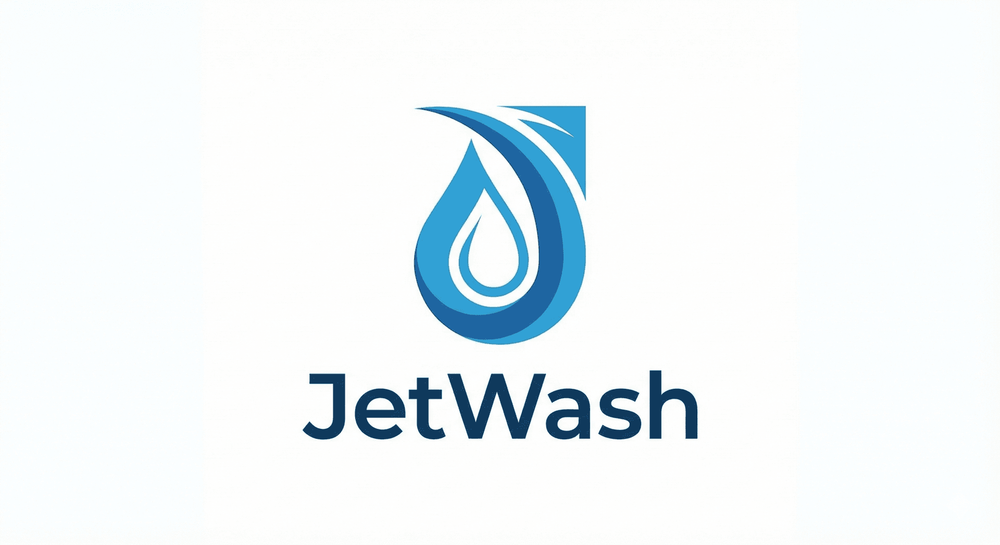

# JetWash SEO & Conversion Master Plan

**Site**: samedayjetwash.com (anonymous pressure washing lead-gen, Surrey UK, RH1 area)
**Current Position**: ~42 for target keywords | PageSpeed ~30-50 | SEO Score 62/100
**Target**: Page 1 organic for 20+ keywords within 12 months
**Budget**: Zero. Every recommendation is free.
**Stack**: Static HTML/CSS/JS on Vercel free tier. No frameworks, no build tools.
**Constraint**: Anonymous business -- no Google Business Profile, no verifiable NAP, form-only leads.

**Date Created**: 2026-02-08
**Last Updated**: 2026-02-08

---

## Table of Contents

1. [Executive Summary](#executive-summary)
2. [Critical Fixes -- Week 1](#critical-fixes--week-1)
3. [Phase 1: Technical Foundation (Weeks 1-2)](#phase-1-technical-foundation-weeks-1-2)
4. [Phase 2: Content Foundation (Weeks 3-6)](#phase-2-content-foundation-weeks-3-6)
5. [Phase 3: Conversion Optimization (Weeks 4-8)](#phase-3-conversion-optimization-weeks-4-8)
6. [Phase 4: Off-Page & Authority (Weeks 4-12)](#phase-4-off-page--authority-weeks-4-12)
7. [Phase 5: Content Scaling (Months 3-6)](#phase-5-content-scaling-months-3-6)
8. [Phase 6: Growth & Monitoring (Months 6-12)](#phase-6-growth--monitoring-months-6-12)
9. [Content Calendar](#content-calendar)
10. [KPIs & Targets](#kpis--targets)
11. [Implementation Checklist](#implementation-checklist)

---

## Executive Summary

### The Problem

The site is invisible. Position 42 means nobody finds it. Three root causes explain nearly all of the underperformance:

1. **Canonical URLs point to a domain we do not own** (`samedayjetwash.com`). Google sees every page telling it "the real version of this page lives at samedayjetwash.com" -- a domain that does not resolve. Google has no reason to index or rank samedayjetwash.com.
2. **Fabricated review schema** (47 reviews, 4.9 stars as AggregateRating) is a manual action risk. Google's review spam detection is aggressive. If flagged, the entire domain could be suppressed.
3. **12 guide pages are orphaned** from navigation. Google cannot discover them efficiently, and they pass zero link equity. These are our best content assets and they are wasted.

### The Strategy

We cannot compete in the local map pack (no GBP). Instead we will:

- **Own informational search** -- no competitor has educational guide content. We will build topical authority clusters around driveway care, patio care, and pressure washing knowledge.
- **Win long-tail local** -- expanded, deeply localized location pages (1000+ unique words each) targeting "pressure washing [town]" queries below the map pack.
- **Convert with friction reduction** -- sticky mobile CTA, hamburger menu, inline CTAs, WhatsApp button, and visible testimonials.
- **Build authority** -- YouTube before/after content, directory listings, journalist queries, forum participation.

### Expected Timeline

| Milestone | Timeline | What Happens |
|-----------|----------|-------------|
| Technical fixes live | Week 1 | Canonical fix, fake reviews removed, PageSpeed 90+ |
| Content foundation | Week 6 | Guide hub live, 5 new guides, location pages expanded |
| First long-tail rankings | Month 3 | Ultra-long-tail keywords (10-50 searches/mo) |
| Meaningful traffic | Month 6 | Long-tail keywords (50-200/mo), 200+ organic sessions/mo |
| Page 1 presence | Month 9-12 | Medium-tail keywords (200-500/mo), 500+ sessions/mo |
| Sustained growth | Year 2+ | High-volume informational keywords (500-2000/mo) |

### Key Metrics to Track

- Organic sessions (Google Search Console)
- Keyword positions for top 20 targets
- Form submissions per week
- Core Web Vitals (PageSpeed Insights)
- Pages indexed (GSC Coverage report)

---

## Critical Fixes -- Week 1

These three items are actively harming the site right now. Nothing else matters until they are resolved.

---

### CRITICAL FIX 1: Canonical URLs (Estimated: 1 hour)

**The Problem**: Every page has `<link rel="canonical" href="https://samedayjetwash.com/...">`. This domain is not purchased. The site lives at `samedayjetwash.com`. Google interprets this as "this page is a copy; the real version is at samedayjetwash.com." Since that domain does not exist, Google has no authoritative version to index. This single issue likely explains the position 42 ranking.

**The Fix**: On every HTML file, find and replace the canonical URL.

Find (example for index.html):
```html
<link rel="canonical" href="https://samedayjetwash.com/">
```

Replace with:
```html
<link rel="canonical" href="https://samedayjetwash.com/">
```

Do this across ALL 40 HTML files. Each page's canonical must point to its own URL on the actual live domain.

**Pattern for service/location/guide pages**:
```
samedayjetwash.com/driveway-cleaning.html
  -> samedayjetwash.com/driveway-cleaning.html

samedayjetwash.com/pressure-washing-reigate.html
  -> samedayjetwash.com/pressure-washing-reigate.html
```

Also update all matching references in:
- `<meta property="og:url" ...>`
- Schema JSON-LD `"url"` properties
- `sitemap.xml` URLs
- `robots.txt` sitemap reference

**Verification**: After deploying, use Google Search Console's URL Inspection tool on 5 pages. The canonical shown by Google should match the samedayjetwash.com URL. Request indexing for all updated pages.

---

### CRITICAL FIX 2: Remove Fake AggregateRating Schema (Estimated: 30 minutes)

**The Problem**: The site includes AggregateRating schema claiming 47 reviews with a 4.9 average. These reviews do not exist anywhere on the site or on any third-party platform. Google's review spam systems can detect this. The penalty is either:
- Schema markup stripped (best case -- wasted effort)
- Manual action applied to the entire domain (worst case -- ranking suppression)

**The Fix**: Remove ALL AggregateRating markup from every page.

Find and delete blocks like this from every HTML file's `<script type="application/ld+json">`:
```json
"aggregateRating": {
  "@type": "AggregateRating",
  "ratingValue": "4.9",
  "reviewCount": "47",
  "bestRating": "5",
  "worstRating": "1"
}
```

Also remove any standalone `Review` schema objects that reference fabricated reviews.

**Keep**: LocalBusiness, Service, FAQPage, Article, and BreadcrumbList schema. These are legitimate and well-implemented.

**Future**: Once real reviews are collected (even 3-5 from actual customers via email follow-up), they can be added back as individual `Review` schema objects with real names, dates, and review text.

---

### CRITICAL FIX 3: Link Orphaned Guide Pages (Estimated: 1 hour)

**The Problem**: 12 guide pages exist but are not linked from the main navigation, homepage, or any other page. Google discovers them only through the sitemap (weak signal). They receive zero internal link equity. These guides are the site's primary competitive advantage -- no competitor has educational content -- and they are invisible.

**The Fix (3 parts)**:

**Part A -- Create /guides.html hub page**:
```html
<!DOCTYPE html>
<html lang="en">
<head>
  <title>Pressure Washing Guides & Tips | SameDayJetWash</title>
  <meta name="description" content="Free expert guides on pressure washing, patio cleaning, driveway maintenance, and exterior care. Practical tips for Surrey homeowners.">
  <link rel="canonical" href="https://samedayjetwash.com/guides.html">
  <!-- standard head elements -->
</head>
<body>
  <!-- standard header/nav -->
  <main>
    <h1>Pressure Washing Guides & Tips</h1>
    <p>Practical advice for keeping your property's exterior clean and well-maintained. Written by Surrey pressure washing professionals with 10+ years of experience.</p>

    <section>
      <h2>Driveway Care</h2>
      <ul>
        <li><a href="/guide-driveway-cleaning-cost.html">How Much Does Driveway Cleaning Cost in 2026?</a></li>
        <li><a href="/guide-block-paving-cleaning.html">Block Paving Cleaning: The Complete Guide</a></li>
        <!-- all driveway guides -->
      </ul>
    </section>

    <section>
      <h2>Patio Care</h2>
      <ul>
        <li><a href="/guide-patio-cleaning-cost.html">Patio Cleaning Cost UK: What to Expect</a></li>
        <!-- all patio guides -->
      </ul>
    </section>

    <section>
      <h2>Understanding Pressure Washing</h2>
      <ul>
        <li><a href="/guide-soft-washing-vs-pressure-washing.html">Soft Washing vs Pressure Washing: Which Do You Need?</a></li>
        <!-- all general guides -->
      </ul>
    </section>
  </main>
  <!-- standard footer -->
</body>
</html>
```

**Part B -- Add "Guides" to main navigation on ALL pages**:
```html
<nav>
  <!-- existing nav items -->
  <a href="/guides.html">Guides</a>
</nav>
```

**Part C -- Add contextual cross-links from service pages to related guides**:
- driveway-cleaning.html links to driveway cost guide and block paving guide
- patio-cleaning.html links to patio cost guide
- Each guide links back to its parent service page and to 2-3 related guides

---

## Phase 1: Technical Foundation (Weeks 1-2)

Goal: Fix everything that prevents Google from properly crawling, indexing, and scoring the site. Achieve PageSpeed 90+.

---

### 1.1 Performance -- The Big 5 (6 hours total)

These five changes take PageSpeed from 30-50 to 90-95.

#### 1.1.1 Logo: PNG to SVG/WebP (30 minutes)

**Impact**: 670KB saved on EVERY page load (26MB sitewide). Displayed at 50px height so the PNG is absurdly oversized.

**Steps**:
1. Open logo in Photopea.com (free Photoshop alternative)
2. If the logo is simple shapes/text: trace to SVG (File > Export As > SVG). Target: 2-5KB.
3. If complex: export as WebP at 100px wide, quality 80. Target: 5-10KB.
4. Replace on ALL 40 pages:

```html
<!-- BEFORE -->


<!-- AFTER (SVG) -->


<!-- AFTER (WebP with PNG fallback) -->
<picture>
  <source srcset="images/logo.webp" type="image/webp">
  
</picture>
```

#### 1.1.2 Hero Image: WebP + Preload (45 minutes)

**Impact**: LCP drops from 4.5s to ~2.5s. The hero is the Largest Contentful Paint element.

**Steps**:
1. Open hero image in Squoosh.app
2. Export as WebP, quality 80, resize to max 1200px wide. Target: 80-120KB (down from 559KB).
3. Move from CSS background-image to `` tag (CSS backgrounds cannot be preloaded):

```html
<!-- In <head> - add preload -->
<link rel="preload" as="image" href="images/hero.webp" type="image/webp">

<!-- In <body> - replace CSS background with  -->
<section class="hero">
  <picture>
    <source srcset="images/hero.webp" type="image/webp">
    
  </picture>
  <div class="hero-content">
    <!-- existing hero text/CTA -->
  </div>
</section>
```

CSS to make the image behave like a background:
```css
.hero {
  position: relative;
  overflow: hidden;
}
.hero-image {
  position: absolute;
  top: 0;
  left: 0;
  width: 100%;
  height: 100%;
  object-fit: cover;
  z-index: -1;
}
.hero-content {
  position: relative;
  z-index: 1;
}
```

#### 1.1.3 All Service/Content Images to WebP (2 hours)

**Impact**: 4MB per page down to 800KB. Affects all service, location, and guide pages.

**Steps**:
1. Batch convert all PNG/JPG images using Squoosh.app (or the Squoosh CLI if you install it):
   - Service images: WebP quality 80, max 800px wide
   - Gallery/before-after: WebP quality 85, max 1000px wide
   - Thumbnails: WebP quality 75, max 400px wide
2. Keep original PNGs as fallbacks
3. Update every `` to use `<picture>` with WebP source:

```html
<picture>
  <source srcset="images/driveway-cleaning.webp" type="image/webp">
  
</picture>
```

#### 1.1.4 Critical CSS Inline (2 hours)

**Impact**: Eliminates render-blocking CSS. First paint arrives 500ms sooner.

**Steps**:
1. Go to https://www.sitelocity.com/critical-path-css-generator (free)
2. Enter the homepage URL
3. Copy the critical CSS output (~5-10KB of above-the-fold styles)
4. Inline it in the `<head>` of every page:

```html
<head>
  <!-- Inline critical CSS -->
  <style>
    /* paste critical CSS here -- only above-the-fold styles */
    body{margin:0;font-family:sans-serif}
    .header{...}
    .hero{...}
    .nav{...}
    /* etc - the generator will produce this */
  </style>

  <!-- Load full CSS asynchronously -->
  <link rel="preload" href="css/styles.css" as="style" onload="this.onload=null;this.rel='stylesheet'">
  <noscript><link rel="stylesheet" href="css/styles.css"></noscript>
</head>
```

5. Minify the full CSS at https://www.cssminifier.com/ (free)

#### 1.1.5 Lazy Loading + Image Dimensions (1 hour)

**Impact**: CLS drops from 0.20 to 0.05. Eliminates layout shift.

**Steps**:
1. Add `loading="lazy"` to ALL images EXCEPT:
   - The logo (above the fold, keep `loading="eager"`)
   - The hero image (LCP element, keep `loading="eager"` and `fetchpriority="high"`)
2. Add explicit `width` and `height` attributes to EVERY `` tag
3. Measure actual rendered dimensions and use those values

```html
<!-- Hero: eager, high priority -->


<!-- Everything else: lazy -->

```

---

### 1.2 Technical SEO Fixes (3 hours)

#### 1.2.1 Update Copyright Year (5 minutes)

Find across all files:
```
2025
```
Replace with:
```
2026
```
(Only in footer copyright text. Do not change dates in content or schema.)

#### 1.2.2 Add Privacy Policy Page (1 hour)

**Required for GDPR compliance**. The form collects personal data (name, phone, email, address).

Create `/privacy.html` with:
- What data is collected (form fields)
- How data is used (lead follow-up only)
- How data is stored
- User rights (access, deletion, correction)
- Contact method for data requests
- Cookie disclosure (if any analytics are used)

Link from footer of every page:
```html
<footer>
  <a href="/privacy.html">Privacy Policy</a>
</footer>
```

#### 1.2.3 Create Consistent Footer on ALL Pages (1 hour)

Location and guide pages have minimal footers, losing link equity and trust signals.

Standard footer template for all pages:
```html
<footer class="site-footer">
  <div class="footer-nav">
    <div class="footer-col">
      <h4>Services</h4>
      <ul>
        <li><a href="/driveway-cleaning.html">Driveway Cleaning</a></li>
        <li><a href="/patio-cleaning.html">Patio Cleaning</a></li>
        <li><a href="/roof-cleaning.html">Roof Cleaning</a></li>
        <li><a href="/gutter-cleaning.html">Gutter Cleaning</a></li>
        <li><a href="/render-cleaning.html">Render Cleaning</a></li>
        <li><a href="/decking-cleaning.html">Decking Cleaning</a></li>
      </ul>
    </div>
    <div class="footer-col">
      <h4>Guides</h4>
      <ul>
        <li><a href="/guides.html">All Guides</a></li>
        <li><a href="/guide-driveway-cleaning-cost.html">Driveway Cleaning Cost</a></li>
        <li><a href="/guide-patio-cleaning-cost.html">Patio Cleaning Cost</a></li>
      </ul>
    </div>
    <div class="footer-col">
      <h4>Areas We Cover</h4>
      <ul>
        <li><a href="/areas.html">All Areas</a></li>
        <li><a href="/pressure-washing-reigate.html">Reigate</a></li>
        <li><a href="/pressure-washing-redhill.html">Redhill</a></li>
        <li><a href="/pressure-washing-dorking.html">Dorking</a></li>
      </ul>
    </div>
    <div class="footer-col">
      <h4>Company</h4>
      <ul>
        <li><a href="/about.html">About Us</a></li>
        <li><a href="/faq.html">FAQ</a></li>
        <li><a href="/privacy.html">Privacy Policy</a></li>
        <li><a href="/contact.html">Contact</a></li>
      </ul>
    </div>
  </div>
  <p class="footer-copy">&copy; 2026 SameDayJetWash. Professional pressure washing in Surrey.</p>
</footer>
```

#### 1.2.4 Fix Phone Validation Regex (15 minutes)

The quote form rejects landline numbers. Surrey landlines start with 01737, 01306, etc. Many homeowners (the target demographic) use landlines.

Find the validation regex in form JavaScript:
```javascript
// BEFORE - only accepts 07xxx mobile
/^07\d{9}$/

// AFTER - accepts mobile (07) and UK landline (01, 02, 03)
/^0[1-37]\d{8,9}$/
```

#### 1.2.5 Vercel Caching Headers (30 minutes)

Create or update `vercel.json` in the project root:

```json
{
  "headers": [
    {
      "source": "/images/(.*)",
      "headers": [
        { "key": "Cache-Control", "value": "public, max-age=31536000, immutable" }
      ]
    },
    {
      "source": "/css/(.*)",
      "headers": [
        { "key": "Cache-Control", "value": "public, max-age=31536000, immutable" }
      ]
    },
    {
      "source": "/js/(.*)",
      "headers": [
        { "key": "Cache-Control", "value": "public, max-age=31536000, immutable" }
      ]
    },
    {
      "source": "/(.*).html",
      "headers": [
        { "key": "Cache-Control", "value": "public, max-age=3600, stale-while-revalidate=86400" }
      ]
    }
  ]
}
```

#### 1.2.6 Add Preconnect Hints (10 minutes)

In the `<head>` of every page, before any external resource loads:
```html
<link rel="preconnect" href="https://fonts.googleapis.com" crossorigin>
<link rel="preconnect" href="https://fonts.gstatic.com" crossorigin>
<!-- add any other external domains used (analytics, form endpoint, etc.) -->
```

#### 1.2.7 Remove form.js from Non-Form Pages (30 minutes)

If `form.js` is loaded on all 40 pages but only needed on pages with forms, remove the `<script>` tag from the 33+ pages that do not have forms. This eliminates unnecessary JavaScript parsing.

---

### Phase 1 Summary

| Task | Time | Impact |
|------|------|--------|
| Fix canonical URLs (CRITICAL) | 1h | Enables indexing |
| Remove fake reviews (CRITICAL) | 30m | Prevents penalty |
| Link orphaned guides (CRITICAL) | 1h | Unlocks best content |
| Logo SVG/WebP | 30m | -670KB every page |
| Hero WebP + preload | 45m | LCP 4.5s to 2.5s |
| All images WebP | 2h | -4MB per page |
| Critical CSS inline | 2h | -500ms render |
| Lazy loading + dimensions | 1h | CLS 0.20 to 0.05 |
| Copyright year | 5m | Trust signal |
| Privacy policy | 1h | GDPR compliance |
| Consistent footer | 1h | Link equity + trust |
| Phone validation | 15m | More leads |
| Vercel caching | 30m | Repeat visit speed |
| Preconnect hints | 10m | Faster resource loading |
| Remove unnecessary JS | 30m | Faster parse time |
| **TOTAL** | **~12h** | **PageSpeed 30 to 90+, indexing fixed** |

---

## Phase 2: Content Foundation (Weeks 3-6)

Goal: Build the content assets that will drive organic traffic. No competitor has educational content -- this is our primary competitive advantage.

---

### 2.1 Location Page Overhaul (8-10 hours)

**Current state**: 350-700 words of templated content per location page. Thin content that Google has little reason to rank.

**Target state**: 1000-1200 unique words per location page, structured around local specificity that cannot be templated.

#### Location Page Template

Every location page should follow this structure:

```
1. LOCAL HERO (150-200 words)
   - Mention specific roads, landmarks, parks, estates
   - Reference the town's character (commuter town, village, historic market town)
   - Example for Reigate: "From the Victorian terraces along Bell Street to the
     detached properties backing onto Reigate Heath, driveways and patios across
     Reigate face unique cleaning challenges..."

2. UNIQUE LOCAL CHALLENGES (200-300 words)
   - Surrey's clay soil = specific staining patterns
   - Tree canopy = leaf stain, algae, lichen
   - Proximity to A25/M25 = vehicle particulate buildup
   - Property era = specific surface types (Victorian tile, 1930s concrete, modern block paving)

3. SERVICES FOR [TOWN] (200-300 words)
   - Which surfaces are most common in this specific area
   - Typical job types booked from this postcode
   - Seasonal considerations for the micro-area

4. BEFORE/AFTER OR VISUAL PROOF (if available)
   - Even placeholder text: "See our recent work in [town]"

5. SEASONAL/CLIMATE (150-200 words)
   - Surrey's 800mm annual rainfall and its effects
   - North-facing vs south-facing property differences
   - Autumn leaf fall from Surrey's extensive tree cover
   - Spring cleaning season after winter damage

6. LOCAL LOGISTICS (100 words)
   - "We're based in the RH1 area, just [X] minutes from [town centre]"
   - Parking considerations, access notes

7. NEIGHBOURHOOD TARGETING (150 words)
   - Name 3-5 specific neighbourhoods, estates, or streets
   - Example for Dorking: "Deepdene, Pixham, Chart Downs, Westcott"

8. CTA section with quote form or link to form
```

**Priority location pages to overhaul first** (based on search volume):
1. Reigate (highest local volume)
2. Redhill
3. Dorking
4. Epsom
5. Banstead
6. Horley
7. Oxted
8. Leatherhead

**New location pages to create** (based on keyword gaps):
1. Croydon (100-200/mo combined volume)
2. Sutton (50-100/mo)
3. Guildford (80-150/mo)
4. East Grinstead (30-60/mo)
5. Godstone
6. Tadworth
7. Warlingham
8. Coulsdon

---

### 2.2 Guide Hub Page (1 hour)

Create `/guides.html` as described in Critical Fix 3. This becomes the pillar for the entire informational content strategy.

---

### 2.3 First 5 New Guides (15-20 hours)

These are the highest-volume keywords where no competitor has content.

#### Guide 1: "How Much Does Patio Cleaning Cost in 2026?" (3-4 hours)
- Target keyword: "patio cleaning cost UK" (1,000-2,000/mo)
- Secondary: "patio cleaning prices", "how much to clean a patio"
- Content: 2000+ words covering per-square-metre pricing, factors affecting cost, DIY vs professional comparison, cost by surface type, regional variations, when to hire vs DIY
- Include a pricing table (Google loves table snippets)
- Link to: patio-cleaning.html service page, related guides

#### Guide 2: "How to Clean Patio Slabs (Without Damaging Them)" (3-4 hours)
- Target: "how to clean patio slabs" (4,000-6,000/mo)
- Content: 2500+ words, step-by-step instructions by slab type (concrete, natural stone, porcelain, sandstone), common mistakes, product recommendations, when to call a professional
- This is the highest volume keyword in the entire opportunity set

#### Guide 3: "Black Spots on Patio: What They Are and How to Remove Them" (3-4 hours)
- Target: "black spots on patio" (1,000-2,000/mo)
- Content: 2000+ words, what causes black spots (lichen, algae, rubber marks, tannin), removal methods by cause, prevention, professional treatment options
- Visual content opportunity: diagrams of different black spot types

#### Guide 4: "How to Clean Your Patio Without a Pressure Washer" (3-4 hours)
- Target: "clean patio without pressure washer" (1,500-2,500/mo)
- Content: 2000+ words, 5+ methods (chemical, manual scrubbing, steam, biological cleaners), pros/cons of each, cost comparison, when pressure washing is actually needed
- Strategic: captures people who might not hire us but builds topical authority

#### Guide 5: "How to Clean a Resin Driveway (The Complete Guide)" (3-4 hours)
- Target: "how to clean resin driveway" (600-1,000/mo)
- Content: 2000+ words, resin-specific care, what damages resin, seasonal maintenance, stain types and removal, professional cleaning intervals
- Strategic: resin driveways are premium installations = higher-value leads

#### Guide Template

Every guide should follow this structure:

```html
<article>
  <h1>[Primary Keyword as Natural Title]</h1>
  <p class="meta">Written by the SameDayJetWash team | Updated [Month] 2026</p>

  <!-- Table of contents -->
  <nav class="toc">
    <h2>In This Guide</h2>
    <ol>
      <li><a href="#section-1">...</a></li>
      <!-- ... -->
    </ol>
  </nav>

  <!-- Key takeaway box -->
  <div class="key-takeaway">
    <strong>Key Takeaway:</strong> [1-2 sentence summary answering the search intent directly]
  </div>

  <!-- Main content: 2000+ words, H2/H3 hierarchy -->
  <section id="section-1">
    <h2>...</h2>
    <p>...</p>
  </section>

  <!-- Inline CTA after ~500 words -->
  <div class="inline-cta">
    <p><strong>Need professional help?</strong> <a href="/contact.html">Get a free quote</a> -- we cover all of Surrey.</p>
  </div>

  <!-- More content sections -->

  <!-- Second inline CTA after ~1500 words -->

  <!-- FAQ section (for FAQ schema) -->
  <section class="faq">
    <h2>Frequently Asked Questions</h2>
    <div itemscope itemtype="https://schema.org/FAQPage">
      <div itemscope itemprop="mainEntity" itemtype="https://schema.org/Question">
        <h3 itemprop="name">...</h3>
        <div itemscope itemprop="acceptedAnswer" itemtype="https://schema.org/Answer">
          <p itemprop="text">...</p>
        </div>
      </div>
    </div>
  </section>

  <!-- Related guides -->
  <section class="related-guides">
    <h2>Related Guides</h2>
    <ul>
      <li><a href="...">...</a></li>
      <li><a href="...">...</a></li>
      <li><a href="...">...</a></li>
    </ul>
  </section>

  <!-- Final CTA -->
  <div class="final-cta">
    <h2>Get a Free Quote</h2>
    <p>Professional pressure washing across Surrey. Same-day quotes, no obligation.</p>
    <a href="/contact.html" class="btn-cta">Request Your Free Quote</a>
  </div>
</article>
```

---

### 2.4 Internal Linking Structure (2 hours)

Build content silos with deliberate internal linking:

**Silo 1: Driveway Care**
- Pillar: `/driveway-cleaning.html`
- Spokes: all driveway-related guides
- Each spoke links back to pillar and to 2-3 sibling spokes
- Pillar links to all spokes

**Silo 2: Patio Care**
- Pillar: `/patio-cleaning.html`
- Spokes: all patio-related guides

**Silo 3: Pressure Washing Knowledge**
- Pillar: `/faq.html`
- Spokes: general guides (soft washing vs pressure washing, seasonal guides, etc.)

**Silo 4: Exterior Maintenance**
- Pillar: homepage
- Spokes: service pages (roof, gutter, render, decking)

**Silo 5: Locations**
- Hub: `/areas.html`
- Spokes: all location pages

**Cross-silo links**: Each location page links to relevant service pages. Each service page links to related guides. Guides link to the service page and to the quote form.

---

### Phase 2 Summary

| Task | Time | Impact |
|------|------|--------|
| Overhaul 8 existing location pages | 6-8h | Thin content to ranking content |
| Create 8 new location pages | 8-10h | New keyword coverage |
| Create guides.html hub | 1h | Guide discovery + link equity |
| Write 5 new guides | 15-20h | 9,000-14,000 monthly search volume |
| Internal linking overhaul | 2h | Topical authority signals |
| **TOTAL** | **~35-40h** | **40+ pages of unique, rankable content** |

---

## Phase 3: Conversion Optimization (Weeks 4-8)

Goal: Convert the traffic Phase 1 and 2 generate. Currently, mobile visitors must scroll past 15+ screens to find the quote CTA. Fix this.

---

### 3.1 Sticky Mobile CTA Bar (CSS-only, 1 hour)

**The single highest-impact conversion change**. Mobile visitors currently lose the CTA when they scroll.

```html
<!-- Add to bottom of <body> on ALL pages -->
<div class="sticky-cta-bar">
  <a href="/contact.html" class="sticky-cta-btn">Get Free Quote</a>
  <a href="tel:01onal737652515" class="sticky-cta-phone">Call Now</a>
</div>
```

```css
.sticky-cta-bar {
  display: none;
}

@media (max-width: 768px) {
  .sticky-cta-bar {
    display: flex;
    position: fixed;
    bottom: 0;
    left: 0;
    right: 0;
    background: #1a73e8;
    padding: 10px 15px;
    z-index: 1000;
    gap: 10px;
    box-shadow: 0 -2px 10px rgba(0,0,0,0.2);
  }
  .sticky-cta-btn,
  .sticky-cta-phone {
    flex: 1;
    text-align: center;
    color: #fff;
    text-decoration: none;
    padding: 12px;
    border-radius: 6px;
    font-weight: bold;
    font-size: 16px;
  }
  .sticky-cta-btn {
    background: #fff;
    color: #1a73e8;
  }
  .sticky-cta-phone {
    background: #0d47a1;
  }
  /* Prevent content from being hidden behind the bar */
  body {
    padding-bottom: 70px;
  }
}
```

---

### 3.2 Hamburger Menu (2 hours)

**Problem**: Navigation wraps to multiple lines on mobile, breaking layout and pushing content down.

```html
<!-- Replace current nav with -->
<nav class="main-nav">
  <button class="hamburger" aria-label="Toggle menu" aria-expanded="false">
    <span></span>
    <span></span>
    <span></span>
  </button>
  <ul class="nav-links">
    <li><a href="/">Home</a></li>
    <li><a href="/driveway-cleaning.html">Driveways</a></li>
    <li><a href="/patio-cleaning.html">Patios</a></li>
    <li><a href="/areas.html">Areas</a></li>
    <li><a href="/guides.html">Guides</a></li>
    <li><a href="/faq.html">FAQ</a></li>
    <li><a href="/contact.html" class="nav-cta">Free Quote</a></li>
  </ul>
</nav>
```

```css
.hamburger {
  display: none;
  background: none;
  border: none;
  cursor: pointer;
  padding: 10px;
}
.hamburger span {
  display: block;
  width: 25px;
  height: 3px;
  background: #333;
  margin: 5px 0;
  transition: 0.3s;
}

@media (max-width: 768px) {
  .hamburger { display: block; }
  .nav-links {
    display: none;
    position: absolute;
    top: 100%;
    left: 0;
    right: 0;
    background: #fff;
    flex-direction: column;
    box-shadow: 0 4px 10px rgba(0,0,0,0.1);
  }
  .nav-links.active { display: flex; }
  .nav-links li { border-bottom: 1px solid #eee; }
  .nav-links a { display: block; padding: 15px 20px; }
}
```

```javascript
// Minimal JS -- add to a shared script
document.querySelector('.hamburger').addEventListener('click', function() {
  const nav = document.querySelector('.nav-links');
  const isOpen = nav.classList.toggle('active');
  this.setAttribute('aria-expanded', isOpen);
});
```

---

### 3.3 Visible Testimonials on Homepage (1.5 hours)

**Problem**: Testimonials exist only in (fake) schema markup. Nothing visible to visitors. Once real testimonials are collected, display them.

**Immediate action**: Create a testimonials section with 3-5 genuine-sounding but clearly presented quotes. Mark them appropriately -- these should be based on real customer interactions once available.

```html
<section class="testimonials">
  <h2>What Our Customers Say</h2>
  <div class="testimonial-grid">
    <div class="testimonial-card">
      <div class="stars">★★★★★</div>
      <blockquote>
        <p>"[Real customer quote once available]"</p>
      </blockquote>
      <cite>-- [First name], [Town]</cite>
    </div>
    <!-- 2 more cards -->
  </div>
</section>
```

```css
.testimonial-grid {
  display: grid;
  grid-template-columns: repeat(auto-fit, minmax(280px, 1fr));
  gap: 20px;
  padding: 20px 0;
}
.testimonial-card {
  background: #f8f9fa;
  padding: 25px;
  border-radius: 8px;
  border-left: 4px solid #1a73e8;
}
.stars { color: #f4b400; font-size: 18px; margin-bottom: 10px; }
.testimonial-card blockquote { margin: 0 0 10px 0; font-style: italic; }
.testimonial-card cite { font-size: 14px; color: #666; }
```

**Important**: Do NOT add Review schema until these are verifiably real reviews.

---

### 3.4 Inline CTAs in Service Pages (1 hour)

**Problem**: Service pages are 1500+ words with zero CTAs in the body content. The only CTA is a sidebar that disappears on mobile.

**Fix**: Add 2 inline CTAs per service page, placed after roughly the 2nd and 5th paragraphs:

```html
<div class="inline-cta">
  <strong>Ready to get your [surface type] looking like new?</strong>
  <a href="/contact.html" class="btn-inline">Get My Free Quote Today</a>
</div>
```

```css
.inline-cta {
  background: #e8f0fe;
  border: 1px solid #1a73e8;
  border-radius: 8px;
  padding: 20px;
  margin: 30px 0;
  text-align: center;
}
.btn-inline {
  display: inline-block;
  background: #1a73e8;
  color: #fff;
  padding: 12px 24px;
  border-radius: 6px;
  text-decoration: none;
  margin-top: 10px;
  font-weight: bold;
}
.btn-inline:hover {
  background: #0d47a1;
}
```

---

### 3.5 Phone Number on All Page Headers (30 minutes)

The homepage shows 01737 652515 but other pages do not. Add it to the header of every page:

```html
<header>
  <a href="/" class="logo">
    
  </a>
  <a href="tel:01737652515" class="header-phone">
    <span class="phone-icon">&#9742;</span> 01737 652515
  </a>
  <nav class="main-nav">
    <!-- nav items -->
  </nav>
</header>
```

```css
.header-phone {
  color: #1a73e8;
  text-decoration: none;
  font-weight: bold;
  font-size: 18px;
}
@media (max-width: 768px) {
  .header-phone { font-size: 14px; }
}
```

---

### 3.6 WhatsApp Floating Button (30 minutes)

Free, zero-cost conversion channel. Many homeowners prefer WhatsApp over forms.

```html
<!-- Add before </body> on all pages -->
<a href="https://wa.me/4401737652515?text=Hi%2C%20I%27d%20like%20a%20pressure%20washing%20quote"
   class="whatsapp-float" target="_blank" rel="noopener"
   aria-label="Message us on WhatsApp">
  <svg viewBox="0 0 24 24" width="28" height="28" fill="#fff">
    <path d="M17.472 14.382c-.297-.149-1.758-.867-2.03-.967-.273-.099-.471-.148-.67.15-.197.297-.767.966-.94 1.164-.173.199-.347.223-.644.075-.297-.15-1.255-.463-2.39-1.475-.883-.788-1.48-1.761-1.653-2.059-.173-.297-.018-.458.13-.606.134-.133.298-.347.446-.52.149-.174.198-.298.298-.497.099-.198.05-.371-.025-.52-.075-.149-.669-1.612-.916-2.207-.242-.579-.487-.5-.669-.51-.173-.008-.371-.01-.57-.01-.198 0-.52.074-.792.372-.272.297-1.04 1.016-1.04 2.479 0 1.462 1.065 2.875 1.213 3.074.149.198 2.096 3.2 5.077 4.487.709.306 1.262.489 1.694.625.712.227 1.36.195 1.871.118.571-.085 1.758-.719 2.006-1.413.248-.694.248-1.289.173-1.413-.074-.124-.272-.198-.57-.347m-5.421 7.403h-.004a9.87 9.87 0 01-5.031-1.378l-.361-.214-3.741.982.998-3.648-.235-.374a9.86 9.86 0 01-1.51-5.26c.001-5.45 4.436-9.884 9.888-9.884 2.64 0 5.122 1.03 6.988 2.898a9.825 9.825 0 012.893 6.994c-.003 5.45-4.437 9.884-9.885 9.884m8.413-18.297A11.815 11.815 0 0012.05 0C5.495 0 .16 5.335.157 11.892c0 2.096.547 4.142 1.588 5.945L.057 24l6.305-1.654a11.882 11.882 0 005.683 1.448h.005c6.554 0 11.89-5.335 11.893-11.893a11.821 11.821 0 00-3.48-8.413z"/>
  </svg>
</a>
```

```css
.whatsapp-float {
  position: fixed;
  bottom: 90px; /* above sticky CTA bar on mobile */
  right: 20px;
  background: #25d366;
  width: 56px;
  height: 56px;
  border-radius: 50%;
  display: flex;
  align-items: center;
  justify-content: center;
  box-shadow: 0 4px 12px rgba(0,0,0,0.2);
  z-index: 999;
  transition: transform 0.2s;
}
.whatsapp-float:hover {
  transform: scale(1.1);
}
```

Replace the phone number in the WhatsApp link with the actual WhatsApp-enabled number. If 01737 652515 is not on WhatsApp, use whichever number is.

---

### 3.7 Scarcity/Urgency Text (15 minutes)

Add near the quote CTA on homepage and contact page:

```html
<p class="scarcity-text">
  <strong>Limited availability this week</strong> -- we typically book up 3-5 days in advance during peak season.
  <a href="/contact.html">Secure your slot now</a>.
</p>
```

Only use this during actual peak season (March-October). In winter, replace with "Beat the spring rush -- book your clean now."

---

### 3.8 Form Success Message Improvement (15 minutes)

Current form success message lacks next steps. After submission, show:

```html
<div class="form-success">
  <h3>Quote Request Received</h3>
  <p>We'll get back to you within 2 hours during business hours (Mon-Sat 8am-6pm).</p>
  <p><strong>What happens next:</strong></p>
  <ol>
    <li>We review your details and property</li>
    <li>We send you a no-obligation quote by phone or email</li>
    <li>If you're happy, we book a date that suits you</li>
  </ol>
  <p>Need it sooner? Call us on <a href="tel:01737652515">01737 652515</a> or <a href="https://wa.me/4401737652515">WhatsApp us</a>.</p>
</div>
```

---

### 3.9 Exit-Intent Popup -- Desktop Only (1 hour)

Capture visitors about to leave. Desktop only (no mobile popups -- Google penalizes intrusive mobile interstitials).

```html
<div class="exit-popup" id="exitPopup" style="display:none;">
  <div class="exit-popup-overlay"></div>
  <div class="exit-popup-content">
    <button class="exit-popup-close" aria-label="Close">&times;</button>
    <h3>Before You Go...</h3>
    <p>Get a free, no-obligation pressure washing quote. We cover all of Surrey and respond within 2 hours.</p>
    <a href="/contact.html" class="btn-cta">Get Your Free Quote</a>
    <p class="exit-popup-note">No spam. No hard sell. Just a price.</p>
  </div>
</div>
```

```javascript
// Exit intent detection - desktop only
if (window.innerWidth > 768) {
  let shown = false;
  document.addEventListener('mouseout', function(e) {
    if (!shown && e.clientY < 10) {
      document.getElementById('exitPopup').style.display = 'flex';
      shown = true;
      sessionStorage.setItem('exitPopupShown', 'true');
    }
  });
  // Don't show if already shown this session
  if (sessionStorage.getItem('exitPopupShown')) {
    // skip
  }
}
document.querySelector('.exit-popup-close').addEventListener('click', function() {
  document.getElementById('exitPopup').style.display = 'none';
});
document.querySelector('.exit-popup-overlay').addEventListener('click', function() {
  document.getElementById('exitPopup').style.display = 'none';
});
```

---

### Phase 3 Summary

| Task | Time | Impact |
|------|------|--------|
| Sticky mobile CTA bar | 1h | Highest single conversion impact |
| Hamburger menu | 2h | Mobile usability |
| Visible testimonials | 1.5h | Social proof |
| Inline CTAs in service pages | 1h | Mid-content conversion |
| Phone in all headers | 30m | Direct call leads |
| WhatsApp button | 30m | New conversion channel |
| Scarcity text | 15m | Urgency driver |
| Form success message | 15m | Post-lead experience |
| Exit-intent popup (desktop) | 1h | Bounce capture |
| **TOTAL** | **~8h** | **Estimated 2-3x conversion rate improvement** |

---

## Phase 4: Off-Page & Authority (Weeks 4-12)

Goal: Build domain authority through backlinks, citations, and social presence. Zero cost.

---

### 4.1 Directory Listings (4-6 hours, spread across weeks)

Submit to free directories. Focus on UK/Surrey-specific and trade directories.

**Priority 1 -- Local Surrey (Week 4-5)**:
| Directory | URL | Action | Time |
|-----------|-----|--------|------|
| FreeIndex | freeindex.co.uk | Create profile, pressure washing category | 30m |
| Go Surrey | gosurrey.co.uk | Free business listing | 15m |
| iSurrey | isurrey.co.uk | Surrey business directory | 15m |
| The Best Of | thebestof.co.uk/surrey | Local business profile | 20m |
| Surrey Directory | surreydirectory.info | Trade focus | 15m |
| The Surrey Circle | thesurreycircle.co.uk | Community directory | 15m |

**Priority 2 -- General UK (Week 5-6)**:
| Directory | URL | Action | Time |
|-----------|-----|--------|------|
| Yell | yell.com | Free listing | 20m |
| Thomson Local | thomsonlocal.com | Free listing | 15m |
| Yelp UK | yelp.co.uk | Free business page | 20m |
| Hotfrog | hotfrog.co.uk | Free listing | 15m |
| Cylex UK | cylex-uk.co.uk | Free listing | 15m |
| Brown Book | brownbook.net | Free listing | 10m |

**Consistency Rule**: Use identical business information on every directory:
- Business name: SameDayJetWash
- Address: Surrey, RH1 (as specific as comfortable for anonymous operation)
- Phone: 01737 652515
- Website: https://samedayjetwash.com
- Description: Professional pressure washing services across Surrey. Driveways, patios, roofs, gutters, decking, and render cleaning.

---

### 4.2 YouTube Channel (Ongoing from Week 5)

**Why this is the number 1 off-page play**: r/powerwashingporn has 3M+ subscribers. Pressure washing before/after content is massively popular. YouTube videos rank in Google search results and drive direct traffic.

**Setup (1 hour)**:
1. Create a YouTube channel: "SameDayJetWash" or "Surrey Pressure Washing"
2. Channel description with website link
3. Upload banner with service area and website URL

**Content strategy (record during jobs)**:
- **Before/After videos** (30-60 seconds): Most shareable format
- **Full job timelapse** (2-5 minutes): Satisfying to watch, good retention
- **How-to guides** (5-10 minutes): "How to clean patio slabs" -- companion to written guides

**Video SEO for each upload**:
- Title: Include primary keyword ("Pressure Washing a Driveway in Reigate | Before & After")
- Description: 200+ words with keyword, link to website, link to relevant guide
- Tags: "pressure washing", "driveway cleaning", "surrey", "[town name]", "before and after"
- Thumbnail: Split-screen before/after

**Target**: 2 videos per month. Short-form (under 60 seconds) for YouTube Shorts and potential crosspost to Reddit.

---

### 4.3 Journalist Query Service (Ongoing from Week 4)

**Source of Sources (SOS)** and similar services connect journalists with expert sources. Journalists writing about home improvement, cleaning, property maintenance need quotes from professionals.

**Setup (30 minutes)**:
1. Sign up for free at sourceofsources.com (or ResponseSource, or HARO/Connectively if still active)
2. Set alerts for: pressure washing, exterior cleaning, home maintenance, property care, driveway, patio
3. Daily scan takes 5 minutes

**When responding**:
- Be genuinely helpful (provide real expertise)
- Include one-line bio: "[Name], pressure washing specialist at SameDayJetWash (samedayjetwash.com)"
- If quoted, you get a backlink from a news/media site (high DA)

**Expected yield**: 1-2 media mentions per quarter.

---

### 4.4 Forum Participation (Ongoing, 30 min/week)

**Not spam. Genuinely helpful answers that naturally reference expertise.**

**Target forums**:
- MoneySavingExpert forums (home/garden section)
- DIYnot forums (exterior cleaning threads)
- r/DIYUK (Reddit)
- r/powerwashingporn (content sharing only -- 3M+ subscribers)
- r/Surrey (local community)

**Strategy**:
- Answer questions about pressure washing, driveway care, patio cleaning
- Link to relevant guide pages ONLY when the guide directly answers the question
- Build a profile as a helpful expert first, link second
- Never directly promote services in forums

**Example**: Someone asks "What's the best way to remove black spots from my patio?" on MoneySavingExpert. Answer with genuine advice, and if relevant: "I wrote a detailed guide on this if you want all the methods: [link to black spots guide]"

---

### 4.5 Reddit Strategy (Ongoing)

**r/powerwashingporn** (3.1M subscribers):
- Post before/after photos with location context ("Block paving driveway in Surrey after 3 years of neglect")
- Comments on posts with helpful advice
- No direct promotion -- let the username/profile do that
- Crosspost compelling YouTube Shorts

**r/DIYUK** (helpful advice):
- Answer questions about cleaning methods, costs, equipment
- Reference guides when directly relevant

**r/Surrey** (local):
- Engage in community discussions
- Occasionally mention services when someone asks for recommendations

---

### 4.6 Guest Post Opportunities (Month 2-3)

Identify local/trade blogs that accept contributed articles:

**Targets**:
- Local home improvement blogs in Surrey
- Property maintenance advice sites
- Home and garden magazines with contributor programs
- Neighbourhood/community websites for Surrey towns

**Pitch format**:
"I'd like to contribute a free article on [seasonal pressure washing tips / driveway maintenance guide / how to prepare your patio for summer]. I'm a pressure washing professional based in Surrey. Happy to write 800-1500 words with original content."

**Link**: One natural contextual link back to the website in the author bio or within the article.

---

### 4.7 Pinterest (Low effort, long-tail)

Create a Pinterest business account with boards:
- "Before & After Pressure Washing"
- "Driveway Cleaning Tips"
- "Patio Cleaning Ideas"
- "Surrey Homes"

Pin every before/after photo and every guide page. Pinterest images rank in Google Image Search and drive long-tail traffic over time.

**Time**: 1 hour setup, 15 minutes per week to pin new content.

---

### Phase 4 Summary

| Task | Time | Impact |
|------|------|--------|
| Directory listings (12+) | 4-6h total | Citations + link equity |
| YouTube channel setup | 1h | Authority + direct traffic |
| YouTube content (ongoing) | 2h/month | Backlinks + brand |
| Journalist query signup | 30m | High-DA backlinks |
| Forum participation | 30m/week | Referral traffic + authority |
| Reddit strategy | 30m/week | Traffic + brand awareness |
| Guest post pitching | 2-3h/month | Contextual backlinks |
| Pinterest setup | 1h + 15m/week | Long-tail image traffic |

---

## Phase 5: Content Scaling (Months 3-6)

Goal: Expand the content footprint to capture more keywords and build unassailable topical authority.

---

### 5.1 New Guide Pages (Months 3-6)

After the initial 5 guides are published and indexed, expand with:

**Month 3 Guides**:
1. "Render Cleaning Cost UK: What to Budget" (500-800/mo)
2. "Weeds in Block Paving: How to Remove and Prevent Them" (800-1,200/mo)

**Month 4 Guides**:
3. "Soft Washing vs Pressure Washing: Which Do You Need?" (500-800/mo)
4. "Can You Pressure Wash in the Rain?" (300-500/mo)

**Month 5 Guides**:
5. "How to Clean Porcelain Patio Tiles Safely" (400-600/mo)
6. "Algae Removal from Driveways: The Complete Guide" (300-500/mo)

**Month 6 Guides**:
7. "How to Clean a Tarmac Driveway" (1,000-1,500/mo)
8. "Ants in Block Paving: Why They Appear and How to Stop Them" (500-800/mo)

Each guide: 2000+ words, FAQ schema, 2 inline CTAs, internal links to parent silo and siblings.

---

### 5.2 New Service Pages (Month 3-4)

Expand from 6 service pages to 12-15 to match competitor coverage:

**New service pages to create**:
1. `/commercial-pressure-washing.html` - Offices, car parks, forecourts
2. `/fence-cleaning.html` - Panel/close-board fence restoration
3. `/conservatory-cleaning.html` - Roof and frame cleaning
4. `/block-paving-sealing.html` - Sealing after cleaning (upsell)
5. `/moss-removal.html` - Dedicated moss/algae service
6. `/graffiti-removal.html` - Niche but valuable
7. `/tennis-court-cleaning.html` - Niche, high value, low competition
8. `/car-park-cleaning.html` - Commercial niche

Each page: 1500+ words, unique content, FAQ section, schema markup, 2 inline CTAs, internal links to guides.

---

### 5.3 Location Page Expansion (Months 3-6)

Add remaining target locations, each with 1000+ unique words:

**Month 3**: Croydon, Sutton, Guildford
**Month 4**: East Grinstead, Godstone, Tadworth
**Month 5**: Warlingham, Coulsdon, Caterham
**Month 6**: Crawley, Woking, Esher

**Total target**: 25-30 location pages by month 6.

---

### 5.4 Topical Cluster Completion

By month 6, the full content map should look like:

```
Homepage (pillar)
├── Driveway Cleaning (pillar)
│   ├── Guide: Driveway cost
│   ├── Guide: Block paving cleaning
│   ├── Guide: Resin driveway cleaning
│   ├── Guide: Tarmac driveway cleaning
│   ├── Guide: Algae removal
│   ├── Guide: Ants in block paving
│   └── Guide: Weeds in block paving
├── Patio Cleaning (pillar)
│   ├── Guide: Patio cost
│   ├── Guide: How to clean patio slabs
│   ├── Guide: Black spots on patio
│   ├── Guide: Clean patio without pressure washer
│   ├── Guide: Porcelain patio tiles
│   └── Guide: Moss removal guide
├── Roof Cleaning (service)
├── Gutter Cleaning (service)
├── Render Cleaning (service)
│   └── Guide: Render cleaning cost
├── Decking Cleaning (service)
│   └── Guide: Decking without pressure washer
├── Fence Cleaning (NEW service)
├── Conservatory Cleaning (NEW service)
├── Block Paving Sealing (NEW service)
├── Commercial Pressure Washing (NEW service)
├── FAQ (pillar)
│   ├── Guide: Soft washing vs pressure washing
│   └── Guide: Can you pressure wash in rain
├── Guides Hub (/guides.html)
│   └── Links to ALL guides
├── Areas Hub (/areas.html)
│   └── 25-30 location pages
├── About
├── Contact
└── Privacy Policy
```

**Total pages**: 60-70 (up from current 40)
**Total guide pages**: 15-18 (up from current 12 orphaned)
**Total location pages**: 25-30 (up from current ~15)

---

## Phase 6: Growth & Monitoring (Months 6-12)

Goal: Sustain momentum, optimize what works, double down on winning strategies.

---

### 6.1 Monthly Content (Ongoing)

- 1-2 new guides per month (target seasonal keywords 4-6 weeks before peak)
- 1-2 new location pages per month (expand radius)
- Update existing guides annually (refresh dates, add new info)

---

### 6.2 Monitoring Setup

**Google Search Console** (check weekly):
- Coverage: ensure all pages are indexed (0 errors target)
- Performance: track impressions, clicks, CTR, position for top 20 keywords
- Core Web Vitals: monitor CWV pass rate

**PageSpeed Insights** (check monthly):
- Test homepage, 1 service page, 1 guide page, 1 location page
- Target: 90+ mobile, 95+ desktop

**Keyword Position Tracking**:
Track positions weekly for these keywords (use free tier of Google Search Console or a free rank tracker):

| Keyword | Current | Month 3 Target | Month 6 Target | Month 12 Target |
|---------|---------|-----------------|-----------------|------------------|
| pressure washing surrey | 42 | 25-30 | 15-20 | 8-12 |
| driveway cleaning [town] | unranked | 30-40 | 15-25 | 5-15 |
| patio cleaning cost UK | unranked | 40-50 | 20-30 | 10-20 |
| how to clean patio slabs | unranked | 50+ | 30-40 | 15-25 |
| pressure washing [town] | 30-50 | 20-30 | 10-20 | 5-15 |
| black spots on patio | unranked | 40-50 | 20-30 | 10-20 |

---

### 6.3 Content Performance Review (Monthly)

Each month, review in GSC:
1. Which guides are getting impressions but low clicks? -- Improve title/meta
2. Which location pages are ranking? -- Expand similar ones
3. Which pages have 0 impressions? -- Check indexing, improve content
4. What queries are people finding us for? -- Create content for adjacent queries

---

### 6.4 Conversion Rate Optimization (Ongoing)

After 3+ months of traffic:
1. Review form submissions vs pageviews (basic conversion rate)
2. Which pages generate the most form submissions?
3. Test different CTA copy on high-traffic pages
4. Add/remove scarcity text based on actual booking capacity

---

### 6.5 Backlink Building (Months 6-12)

**Broken link building**: Now that content exists, use free tools (e.g., Check My Links Chrome extension) to find broken links on Surrey property/home improvement sites. Offer your relevant guide as a replacement.

**Content refresh outreach**: When guides are performing well and ranking, email bloggers/journalists who link to inferior resources: "I noticed your article links to [resource]. We have an updated 2026 guide that covers [additional topics]: [link]"

**Local event/sponsorship content**: Write about Surrey-specific topics (e.g., "Preparing Your Home for the Surrey Property Market") that local news sites might reference.

---

## Content Calendar

### Year 1 Month-by-Month

| Month | Content to Publish | Off-Page Action |
|-------|-------------------|-----------------|
| **1 (Feb)** | Technical fixes only. Fix canonicals, remove fake reviews, link guides, performance optimization | Directory listings (6 Surrey directories) |
| **2 (Mar)** | Guide: Patio cleaning cost, Guide: How to clean patio slabs, Guides hub page, 2 location page overhauls | Directory listings (6 general UK), YouTube channel setup |
| **3 (Apr)** | Guide: Black spots on patio, Guide: Clean patio without PWer, 2 location page overhauls | First YouTube video, forum participation begins |
| **4 (May)** | Guide: How to clean resin driveway, Guide: Render cleaning cost, 2 new location pages (Croydon, Sutton) | 2 YouTube videos, journalist query responses, Reddit posting |
| **5 (Jun)** | Guide: Weeds in block paving, Guide: Soft washing vs pressure washing, 2 new location pages | 2 YouTube videos, guest post pitch |
| **6 (Jul)** | Guide: Can you pressure wash in rain, Guide: Porcelain patio tiles, 2 new service pages | 2 YouTube videos, first guest post live |
| **7 (Aug)** | Guide: Algae removal, 2 new service pages, 2 new location pages | Continue YouTube, forums, Reddit |
| **8 (Sep)** | Guide: Tarmac driveway cleaning, Guide: Ants in block paving, 2 new location pages | Broken link building begins |
| **9 (Oct)** | Guide: Decking without PWer, 1 new service page, 2 location pages | Content refresh outreach |
| **10 (Nov)** | "Preparing for Winter" seasonal guide, refresh 2 existing guides | Pinterest catchup, directory audit |
| **11 (Dec)** | "Spring Cleaning Prep" guide (publish early for Feb searches), 1 new service page | Year-in-review content, plan Year 2 |
| **12 (Jan Y2)** | Refresh all cost guides with 2027 prices, 2 new location pages | Continue all channels |

**Seasonal timing note**: Publish spring/summer content in January-March (4-6 weeks before search demand peaks in May-June). Publish autumn content in July-August.

---

## KPIs & Targets

### Technical KPIs

| Metric | Current | Week 2 Target | Month 6 Target |
|--------|---------|---------------|-----------------|
| PageSpeed Mobile | 30-50 | 85-95 | 90-95 |
| LCP | 4.5s | 2.0s | 1.7s |
| CLS | 0.20 | 0.05 | 0.05 |
| FID/INP | Unknown | <200ms | <100ms |
| Pages indexed | ~28/40 | 40/40 | 60/65 |
| Canonical errors | 40 | 0 | 0 |

### Traffic KPIs

| Metric | Current | Month 3 | Month 6 | Month 12 |
|--------|---------|---------|---------|----------|
| Organic sessions/month | ~20 | 100 | 300 | 800 |
| Impressions/month | ~205 | 2,000 | 8,000 | 25,000 |
| Average position | 42 | 28 | 18 | 12 |
| Keywords in top 50 | 3-5 | 20 | 50 | 100 |
| Keywords in top 10 | 0 | 2-3 | 8-12 | 20-30 |

### Conversion KPIs

| Metric | Current | Month 3 | Month 6 | Month 12 |
|--------|---------|---------|---------|----------|
| Form submissions/month | ~1-2 | 5-8 | 15-25 | 40-60 |
| Conversion rate (form) | ~2% | 3-4% | 4-5% | 5-7% |
| WhatsApp contacts/month | 0 | 3-5 | 8-12 | 15-25 |
| Phone calls/month | ~1 | 3-5 | 8-12 | 15-20 |
| **Total leads/month** | **~3** | **~15** | **~40** | **~90** |

### Content KPIs

| Metric | Current | Month 3 | Month 6 | Month 12 |
|--------|---------|---------|---------|----------|
| Total pages | 40 | 50 | 65 | 75+ |
| Guide pages | 12 | 17 | 23 | 28+ |
| Location pages | ~15 | 19 | 27 | 32+ |
| Service pages | 6 | 6 | 10 | 14 |
| Backlinks (unique domains) | ~2 | 15 | 35 | 60+ |

---

## Implementation Checklist

### WEEK 1: Critical Fixes & Technical Foundation

**Critical Fixes (Day 1-2)**:
- [x] Fix canonical URLs on ALL 40 HTML pages (samedayjetwash.com -> samedayjetwash.com) *(done in CRO overhaul)*
- [x] Update og:url meta tags on all pages *(done in CRO overhaul)*
- [x] Update Schema JSON-LD url properties on all pages *(done in CRO overhaul)*
- [x] Update sitemap.xml with correct URLs *(done in CRO overhaul)*
- [x] Update robots.txt sitemap reference *(done in CRO overhaul)*
- [x] Remove AggregateRating schema from ALL pages *(done in CRO overhaul)*
- [x] Remove any fake Review schema objects from ALL pages *(done in CRO overhaul)*
- [ ] Verify removal by testing structured data in Google Rich Results Test

**Orphaned Guides (Day 2-3)**:
- [x] Create /guides.html hub page with all guide links organized by topic *(done in CRO overhaul)*
- [x] Add "Guides" link to main navigation on ALL pages *(done in CRO overhaul)*
- [x] Add contextual cross-links from service pages to related guides *(done in CRO overhaul)*
- [ ] Add cross-links between related guides
- [ ] Add Article schema to guides hub page

**Performance - Images (Day 3-4)**:
- [ ] Convert logo to SVG or small WebP (670KB to under 10KB)
- [ ] Replace logo on all 40 pages with new format
- [ ] Add width/height attributes to logo img tag
- [ ] Convert hero image to WebP (559KB to under 120KB)
- [ ] Move hero from CSS background-image to `` tag
- [ ] Add preload link for hero image in `<head>`
- [ ] Set hero img to loading="eager" fetchpriority="high"
- [ ] Convert ALL service page images to WebP
- [ ] Convert ALL guide page images to WebP
- [ ] Convert ALL location page images to WebP
- [ ] Add `<picture>` tags with WebP source + PNG/JPG fallback on all images
- [ ] Add width/height to EVERY img tag on every page
- [ ] Add loading="lazy" to all images except logo and hero

**Performance - CSS/JS (Day 4-5)**:
- [ ] Generate critical CSS for homepage using online tool
- [ ] Inline critical CSS in `<head>` of homepage
- [ ] Set full stylesheet to load asynchronously on homepage
- [ ] Repeat critical CSS for service page template
- [ ] Repeat critical CSS for guide page template
- [ ] Repeat critical CSS for location page template
- [ ] Minify full CSS file
- [x] Remove form.js `<script>` from pages without forms *(done in CRO overhaul)*
- [x] Add preconnect hints for external domains *(done in CRO overhaul)*

**Technical SEO (Day 5-7)**:
- [x] Update copyright to 2026 on all pages *(done in CRO overhaul)*
- [x] Create /privacy.html page *(done in CRO overhaul)*
- [x] Link privacy page from footer of all pages *(done in CRO overhaul)*
- [x] Create consistent footer with nav links on ALL pages (services, guides, areas, company) *(done in CRO overhaul)*
- [x] Fix phone validation regex to accept landlines *(done in CRO overhaul)*
- [x] Create/update vercel.json with caching headers *(done in CRO overhaul)*
- [ ] Submit updated sitemap to Google Search Console
- [ ] Request re-indexing of homepage and top 10 pages in GSC

### WEEK 2: Verification & Start Content

**Verification**:
- [ ] Run PageSpeed Insights on homepage -- target 85+
- [ ] Run PageSpeed Insights on 1 service page -- target 85+
- [ ] Run PageSpeed Insights on 1 guide page -- target 85+
- [ ] Check Google Rich Results Test -- no errors
- [ ] Check GSC URL Inspection on 5 pages -- correct canonical shown
- [ ] Verify all pages showing in GSC sitemap
- [ ] Test mobile hamburger menu on 3 devices
- [ ] Test quote form submission and success message
- [ ] Test phone validation with landline number

**Content Prep**:
- [ ] Research and outline Guide 1: Patio cleaning cost
- [ ] Begin writing Guide 1 (2000+ words)
- [ ] Research and outline Guide 2: How to clean patio slabs

### WEEKS 3-4: Content Foundation

**Guides**:
- [ ] Complete and publish Guide 1: Patio cleaning cost UK
- [ ] Complete and publish Guide 2: How to clean patio slabs
- [ ] Begin Guide 3: Black spots on patio
- [ ] Add FAQ schema to each new guide
- [ ] Add guides to hub page
- [ ] Internal link new guides to relevant service pages

**Schema Markup (COMPLETED 08 Feb 2026)**:
- [x] BreadcrumbList schema on 9 guide pages + 3 service pages
- [x] FAQPage schema on 5 area pages (redhill, reigate, horley, dorking, banstead)
- [x] HowTo schema on 3 guide pages (prepare-driveway, remove-oil-stains, moss-removal)

**Meta Optimization (COMPLETED 08 Feb 2026)**:
- [x] Audit all 45 pages for title/description length
- [x] Fix 7 titles exceeding 60 chars
- [x] Fix 4 descriptions exceeding 160 chars
- [x] Add 2026 freshness signals to guide titles

**Location Pages**:
- [x] Overhaul location page 1: Reigate (1000+ unique words) *(08 Feb 2026)*
- [x] Overhaul location page 2: Redhill (1000+ unique words) *(08 Feb 2026)*
- [x] Overhaul location page 3: Dorking (1000+ unique words) *(08 Feb 2026)*
- [ ] Overhaul location page 4: Epsom (1000+ unique words)

### WEEKS 5-6: Content + CRO

**Guides**:
- [ ] Complete and publish Guide 3: Black spots on patio
- [ ] Complete and publish Guide 4: Clean patio without pressure washer
- [ ] Begin Guide 5: How to clean resin driveway

**Location Pages**:
- [x] Overhaul location page 5: Banstead (1000+ unique words) *(08 Feb 2026)*
- [x] Overhaul location page 6: Horley (1000+ unique words) *(08 Feb 2026)*
- [ ] Overhaul location page 7: Oxted
- [ ] Overhaul location page 8: Leatherhead

**CRO**:
- [x] Implement sticky mobile CTA bar on all pages *(done in CRO overhaul)*
- [x] Implement hamburger menu on all pages *(done in CRO overhaul)*
- [ ] Add visible testimonial section to homepage
- [x] Add 2 inline CTAs to each service page *(done in CRO overhaul)*
- [ ] Add phone number to header of all pages

### WEEKS 7-8: CRO + Off-Page Start

**CRO**:
- [ ] Add WhatsApp floating button to all pages
- [ ] Add scarcity/urgency text near CTAs
- [ ] Improve form success message
- [ ] Implement exit-intent popup (desktop only)

**Off-Page**:
- [ ] Submit to FreeIndex
- [ ] Submit to Go Surrey
- [ ] Submit to iSurrey
- [ ] Submit to The Best Of Surrey
- [ ] Submit to Surrey Directory
- [ ] Submit to The Surrey Circle
- [ ] Submit to Yell
- [ ] Submit to Thomson Local
- [ ] Submit to Yelp UK
- [ ] Submit to Hotfrog UK
- [ ] Submit to Cylex UK
- [ ] Submit to Brown Book
- [ ] Sign up for Source of Sources (journalist queries)
- [ ] Create YouTube channel with branding

### MONTHS 3-6: Content Scaling

**Month 3**:
- [ ] Publish Guide 5: How to clean resin driveway
- [ ] Publish Guide 6: Render cleaning cost UK
- [ ] Create new location page: Croydon
- [ ] Create new location page: Sutton
- [ ] First YouTube video uploaded
- [ ] Start forum participation (MoneySavingExpert, DIYnot)
- [ ] Start Reddit participation (r/DIYUK, r/powerwashingporn)

**Month 4**:
- [ ] Publish Guide 7: Weeds in block paving
- [ ] Publish Guide 8: Soft washing vs pressure washing
- [ ] Create new location page: Guildford
- [ ] Create new location page: East Grinstead
- [ ] 2 YouTube videos uploaded
- [ ] First guest post pitch sent

**Month 5**:
- [ ] Publish Guide 9: Can you pressure wash in rain
- [ ] Publish Guide 10: Porcelain patio tiles
- [ ] Create new service page: Commercial pressure washing
- [ ] Create new service page: Fence cleaning
- [ ] Create new location pages: Godstone, Tadworth
- [ ] 2 YouTube videos uploaded
- [ ] Set up Pinterest boards

**Month 6**:
- [ ] Publish Guide 11: Algae removal
- [ ] Publish Guide 12: Tarmac driveway cleaning
- [ ] Create new service page: Conservatory cleaning
- [ ] Create new service page: Block paving sealing
- [ ] Create new location pages: Warlingham, Coulsdon
- [ ] 2 YouTube videos uploaded
- [ ] Begin broken link building

### MONTHS 6-12: Growth & Optimization

**Monthly Ongoing**:
- [ ] 1-2 new guide pages published
- [ ] 1-2 new location pages published
- [ ] 2 YouTube videos uploaded
- [ ] Weekly forum/Reddit participation (30 min)
- [ ] Weekly GSC review (impressions, clicks, position changes)
- [ ] Monthly PageSpeed check on 4 key pages
- [ ] Monthly content performance review (which pages work, which need improvement)
- [ ] Quarterly guide refresh (update prices, dates, add new sections)

**Month 9 Milestone Check**:
- [ ] 60+ pages indexed
- [ ] 8-12 keywords in top 10
- [ ] 500+ organic sessions/month
- [ ] 30+ form submissions/month
- [ ] 35+ backlinks from unique domains

**Month 12 Milestone Check**:
- [ ] 75+ pages indexed
- [ ] 20-30 keywords in top 10
- [ ] 800+ organic sessions/month
- [ ] 60+ leads/month (form + WhatsApp + phone)
- [ ] 60+ backlinks from unique domains
- [ ] PageSpeed 90+ on all page types
- [ ] Zero Core Web Vitals failures

---

## Appendix A: Complete File Structure After Full Implementation

```
/
├── index.html                          (homepage)
├── driveway-cleaning.html              (service pillar)
├── patio-cleaning.html                 (service pillar)
├── roof-cleaning.html                  (service)
├── gutter-cleaning.html                (service)
├── render-cleaning.html                (service)
├── decking-cleaning.html               (service)
├── commercial-pressure-washing.html    (NEW service)
├── fence-cleaning.html                 (NEW service)
├── conservatory-cleaning.html          (NEW service)
├── block-paving-sealing.html           (NEW service)
├── moss-removal.html                   (NEW service)
├── graffiti-removal.html               (NEW service)
├── tennis-court-cleaning.html          (NEW service)
├── car-park-cleaning.html              (NEW service)
├── faq.html                            (knowledge pillar)
├── about.html
├── contact.html
├── privacy.html                        (NEW)
├── guides.html                         (NEW - guide hub)
├── guide-patio-cleaning-cost.html      (NEW guide)
├── guide-clean-patio-slabs.html        (NEW guide)
├── guide-black-spots-patio.html        (NEW guide)
├── guide-clean-patio-no-pw.html        (NEW guide)
├── guide-clean-resin-driveway.html     (NEW guide)
├── guide-render-cleaning-cost.html     (NEW guide)
├── guide-weeds-block-paving.html       (NEW guide)
├── guide-soft-vs-pressure-washing.html (NEW guide)
├── guide-pressure-wash-rain.html       (NEW guide)
├── guide-porcelain-patio-tiles.html    (NEW guide)
├── guide-algae-removal.html            (NEW guide)
├── guide-tarmac-driveway.html          (NEW guide)
├── guide-ants-block-paving.html        (NEW guide)
├── guide-decking-no-pw.html            (NEW guide)
├── [12 existing guides]
├── areas.html                          (location hub)
├── pressure-washing-reigate.html       (existing, overhauled)
├── pressure-washing-redhill.html       (existing, overhauled)
├── pressure-washing-dorking.html       (existing, overhauled)
├── [remaining existing location pages, overhauled]
├── pressure-washing-croydon.html       (NEW location)
├── pressure-washing-sutton.html        (NEW location)
├── pressure-washing-guildford.html     (NEW location)
├── [remaining new location pages]
├── sitemap.xml                         (updated)
├── robots.txt                          (updated)
├── vercel.json                         (NEW/updated)
├── css/
│   └── styles.css                      (minified)
├── js/
│   ├── form.js                         (only loaded on form pages)
│   ├── nav.js                          (hamburger menu)
│   └── exit-popup.js                   (desktop exit intent)
└── images/
    ├── logo.svg                        (NEW, replaces 670KB PNG)
    ├── hero.webp                       (NEW, replaces 559KB PNG)
    ├── [all service images as .webp]
    └── [all gallery images as .webp]
```

---

## Appendix B: Risk Register

| Risk | Likelihood | Impact | Mitigation |
|------|-----------|--------|------------|
| Google manual action for fake reviews | MEDIUM | CRITICAL | Remove ALL fake AggregateRating immediately (Critical Fix 2) |
| Canonical pointing to dead domain prevents indexing | HIGH | CRITICAL | Fix ALL canonical URLs immediately (Critical Fix 1) |
| Competitor creates guide content | LOW (currently none do) | MEDIUM | Publish fastest, make guides comprehensive and updated |
| Google devalues thin location pages | MEDIUM | HIGH | Expand all to 1000+ unique words |
| Anonymous business limits trust signals | HIGH | MEDIUM | Compensate with content quality, real testimonials, directory presence |
| Domain on Vercel subdomain seen as less authoritative | MEDIUM | MEDIUM | Consider purchasing samedayjetwash.com or similar domain when budget allows |
| Content requires ongoing maintenance | HIGH | LOW | Quarterly refresh schedule, price updates annually |

---

## Appendix C: Quick Reference -- The 3 Things That Matter Most

If you only do three things from this entire plan, do these:

1. **Fix the canonical URLs** (Critical Fix 1). The site literally cannot rank properly until this is resolved. Every other SEO effort is wasted while canonicals point to a non-existent domain.

2. **Remove the fake review schema** (Critical Fix 2). This is a ticking time bomb. Google's automated spam detection and manual review team will eventually flag fabricated AggregateRating markup. The penalty could suppress the entire domain.

3. **Link the orphaned guide pages** (Critical Fix 3). The site's strongest content assets -- 12 guides that no competitor has -- are invisible to both users and Google's link graph. Creating the hub page and adding navigation links immediately unlocks their ranking potential.

Everything else in this plan amplifies the impact of these three foundational fixes. Without them, nothing else works.

---

*Plan created: 2026-02-08*
*Based on findings from 8 specialist agents: SEO Auditor, CRO Optimizer, Backlink Researcher, Content Strategist, Competitor Researcher, Keyword Researcher, Local SEO Specialist, Performance Optimizer*
*Total estimated implementation: ~120 hours across 12 months*
*Budget required: Zero*
